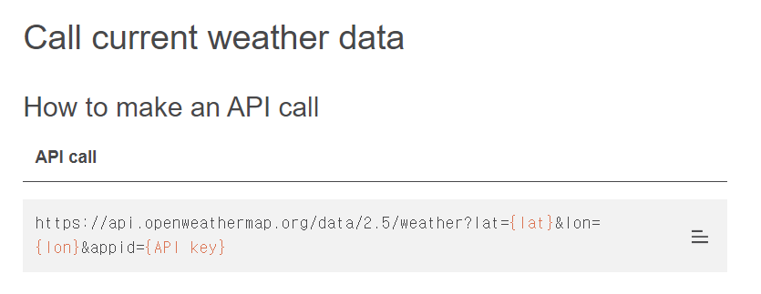

## ch01
### 3D 오브젝트 로드 방법
- useLoader(LoaderType, Resource)

**LoaderType**

r3f에서 지원하는 파일
- GLTF
- OBJ
- FBX

### GLB 파일
```
GL Binary Format

GLTF의 이진 버전. 모든 3D 데이터와 자원이 하나의 이진 파일 내에 포함되어 있다.

모든 리소스가 포함되어 있기 때문에 로딩이 빠르다
```
### Model을 R3F에서 로드하는 방법
```js
function Model() {
  const glb = useLoader(GLTFLoader, '/models/earth.glb')
  return (
    <primitive object={glb.scene} />
  )
}
```
```
primitive은 ThreeJS로 만들어진 3D 오브젝트를 R3F 컴포넌트로 매핑한다.
그래서 컴포넌트를 리액트의 LifeCycle과 상태관리 기능을 사용할 수 있게 된다.
```

### ambientLight
물체의 방향과 상관없이 전체적으로 뿌림
## ch02
### 모델을 불러오는 방법
**scene 사용**
```js
<primitive object={glb.scene.children[0]} />
```
**nodes 사용**
```js
<primitive object={glb.nodes.clear} />
```

### Open Weather Map Site
<a href="https://openweathermap.org">Open Weather Map Site</a> 회원가입 후 사용가능

- **api 사용법**



### useMeme
불필요한 재계산을 막기위해서 사용되는 리액트 컴포넌트

### Suspense
```
리액트 18버전에서 나옴

컴포넌트의 렌더링을 어떤 작업이 끝날때까지 잠시 중단하고 다른 컴포넌트를 먼저 렌더링할 수 있음

이 작업은 API나 GrapQL을 사용할 때 자주 사용

3D 작업할 때 Suspense가 자주 사용됨 => useModel을 사용해서 비동기로 모델을 불러오기 때문이다

그래서 어떠한 모델이 나오지 않을 때 로딩을 구현해주는 것이 필수적이다
```

### Loader 사용법
```js
<Canvas>
  <Suspense>
    <Scene />
  </Suspense>
</Canvas>
<Loader />
```
```
Canvas 밖에다가 Loader를 만들어야 함
```

## ch03
### useFrame훅
```js
<useFrame ((state, delta, xrFrame) => {
  state.camera.position.y -= delta * 0.1
  ref.current.rotation.y += delta * 0.1
})>
```
```
useFrame훅 환경에서 3D렌더링 루프를 커스터마이징하고
각 프레임마다 어떤동작을 수행할 수 있게 해준다

useFrame 훅은 콜백함수가 있고 콜백함수의 매개변수로는
state와 delta를 받는다

state : 현재 프레임의 상태 정보를 포함하는 객체
delta : 마지막 프레임과 현재 프레임 사이의 시간 간격(초단위)
xrFrame : 가상현실 AR, VR에 활용되는 기능(일반적인 웹에서는 사용 불가)
```

### 3D 모션 라이브러리
- react-spring
- gsap
- framer-motion-3d

**framer-motion-3d 사용법1**
```js
import { motion } from 'framer-motion-3d'

const Model = () => {
  return (
    <motion.mesh
      initial={{ rotateX: 0, x: 0 }}
      animate={{ rotateX: 1, x: [0, 1] }}
      transition={{ duration: 1 }}
    >
      {/* 모델 */}
    </motion.mesh>
  )
}
```
- initial : 초기값
- animate : 애니메이션 설정
- transition : 스피드 속성 설정

**framer-motion-3d 사용법2**
```js
import { motion } from 'framer-motion-3d'

const Model = () => {
  return (
    <motion.mesh>
      <cylinderGeometry />
      <motion.meshBasicMaterial
        initial={{ opacity: 1 }}
        animate={{ opacity: [1, 0.3] }}
      />
      {/* 모델 */}
    </motion.mesh>
  )
}
```
```
opacity를 mesh에 주면 적용이되지 않는다.
색은 3D객체에서 Material 쪽에서 제어해줘야 하기 때문이다
```

**framer-motion-3d 선언식**
```js
const Model = () => {
  return (
    <motion.mesh
      initial={{ x: 0 }}
      animate={{ x: 1, transition={ duration: 1 } }}
    >
      {/* 모델 */}
    </motion.mesh>
  )
}
```
아래처럼 변경
```js
const variants = {
  initial={{ x: 0 }}
  animate={{ x: 1, transition={ duration: 1 } }}
}
const Model = () => {
  return (
    <motion.mesh
      variants={variants}
      initial="initial"
      animate="animate"
    >
      {/* 모델 */}
    </motion.mesh>
  )
}
```
```
애니메이션이 많을 경우에는 선언식이 좋다
```

### Raycasting
```
three.js 환경에서 raycasting란 3D장면에서 사용자의 마우스가 가리키는 위치를 결정하는 방법

raycasting은 가사의 광선을 던져서 그 광선이 교차하는 지점을 계산하는 과정

이 지점은 화면상의 3D공간 좌표로 반환 됨
```
**R3F에서 racaster**
```js
<Canvas>
  <mesh onClick={() => console.log('click')}>
    <sphereGeometry />
    <meshStandardMaterial color="hotpink" />
  </mesh>
</Canvas>
```

### mesh이벤트
```js
<mesh
  onClick={(e) => console.log('클릭')}
  onContextMenu={(e) => console.log('콘텍스트 메뉴, 오른쪽 마우스 클릭')}
  onDoubleClick={(e) => console.log('더블 클릭')}
  onWheel={(e) => console.log('마우스 휠')}
  onPointerUp={(e) => console.log('마우스에서 손 뗐을 때(위로)')}
  onPointerDown={(e) => console.log('마우스 버튼을 눌렀을 때(아래로)')}
  onPointerOver={(e) => console.log('포인터가 객체 위에 올라감')}
  onPointerOut={(e) => console.log('포인터가 객체를 벗어남')}
  onPointerEnter={(e) => console.log('포인터가 객체 내로 들어가는 타이밍')}
  onPointerLeave={(e) => console.log('포인터가 객체내에서 벗어나는 타이밍')}
  onPointerMove={(e) => console.log('포인터가 객체내에서 이동 중')}
  onPointerMissed={() => console.log('포인터가 객체내에서 잃어버림')}
  onUpdate={(self) => console.log('프로퍼티가 업데이트 됨')}
/>
```

### framer-motion-3d 이벤트
```js
<motion.mesh
  whileHover={{ scale: 1.1 }} // 호버 애니메이션
  whileTap={{ scale: 0.9 }} // 탬 애니메이션
  onHoverStart={() => console.log('hover start')} // 호버시 실행
  onTap={() => console.log('tapped!')} // 탭 시 실행
/>
```

## ch04
### drei
```
npm i @react-three/drei
```

### Environment 컴포넌트
환경설정에 필요
```js
<Environment
  background={false}
  blur={0}
  preset={null}

  ground // 지면에도 환경맵을 적용할 것인지 boolean
  files={['px.png', 'nx.png', 'py.png', 'ny.png', 'pz.png', 'nz.png']}
  path="/texture"
  scene={undefined}
  encoding={undefined}
/>
```

### Orbitcontrols 활용
객체의 상하좌우를 카메라로 자유자재로 확인
```js
<Canvas>
  <Orbitcontrols
    enabled={}
    target={}
    minDistance={}
    maxDistance={}
    minZoom={}
    maxZoom={}
    minPolarAngle={}
    .
    .
    .
  />
</Canvas>
```

### Bounds 컴포넌트
3D객체 기반으로 한 바운딩 박스를 생성하고 관리하는데 사용.
Bounds 컴포넌트로 감싸진 객체는 바운딩 박스 안에서 관리될 수 있음

```js
<Bounds
  fit
  clip
  observe
  onFit={() => }
  margin={1}
  damping={1}
>
  <mesh />
</Bounds>
```

**속성**
- fit
```
주어진 객체나 경계 상자에 맞게 카메라가 조정되어 해당 객체 또는 경계 상자가 화면에 모두 나타나도록 함.

처음 렌더링 시 초기 뷰를 설정하는데 사용됨.
```
- clip
```
바운딩 박스가 화면을 벗어나지 않도록 자동으로 클리핑 됨.

즉, 너무 큰 객체가 화면을 벗어나지 않도록 보장함.
```
- observe
```
창 크기가 변경될 때마다 바운딩 박스를 새로 조정하는데 사용됨.

창의 크기가 변경되면 렌더링 된 3D 씬에 맞게 새로운 바운딩 박스를 계산하고 카메라를 조정하여 적절한 뷰를 유지함.
```
- margin
```
여백을 추가하면 객체가 화면 가장자리에 가까워지는 것을 방지할 수 있음.
```
- onfit
```
바운딩 박스가 조절된 후에 호출됨. 이를 통해 필요한 추가 동작을 수행할 수 있음.
```
- damping
```
바운딩 박스의 조절이나 애니메이션에 적용되는 계수를 나타냄.
움직임을 부드럽게 만들어주는 역할을 함. 값이 클수록 더 큰 감쇠가 적용됨.
```

### useBounds 훅
```js
const bounds = useBounds()
bounds.refresh()
bounds.getSize()
bounds.clip()
bounds.fit()
```
```
useBounds 훅은 현재 바운딩 박스의 상태를 가져오고, 바운딩 박스를 조절하거나 업데이트하는 데 사용됨.
getSize, refresh, clip, fit 메서드를 가지고 있다
```

## ch05
### React Router DOM
React Router는 동적인 클라이언트 사이드 라우팅을 사용하여 SPA를 만들 수 있도록 하는 라이브러리이다.

클라이언트 라우팅은 앱이 서버에 다른 문서를 요청하지 않고 링크 클릭으로부터 URL을 업데이트 할 수 있게 하는 것.

대신에 앱은 즉시 새로운 UI를 렌더링하고 'fetch'를 사용하여 데이터 요청을 수행하여 새 정보로 페이지를 업데이트할 수 있음.

이를 통해 사용자가 앱 내에서 다양한 화면으로 이동할 때 페이지를 새로고침하지 않고도 URL이 업데이트되며 이로써 사용자 경험이 더욱 부드러워짐

### loader함수
각 라우트는 렌더링하기 전에 라우트 요소에 데이터를 제공하기 위해 loader함수를 정의할 수 있다.

### useNavigate() 훅
프로그래밍 방식으로 페이지를 이동시킬 때 사용.

이 훅은 함수를 반환하며, 해당 함수를 호출함으로써 페이지 이동을 수행할 수 있음.

### useLocation() 훅
현재 브라우저 주소와 관련된 정보를 가져오는 데 사용됨.

이 훅을 사용하면 현재 URL의 경로, 검색쿼리, 해시, 상태 등을 알 수 있다.

### AnimatePresence
React 트리에서 직접적인 자식들이 제거될 때 이를 감지하여 작동함.

자식의 존재를 추적할 수 있으려면 각 자식에게 고유한 key를 부여해 주어야 함.